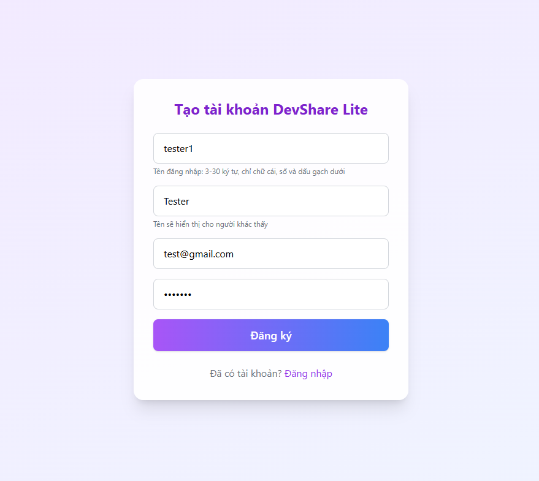
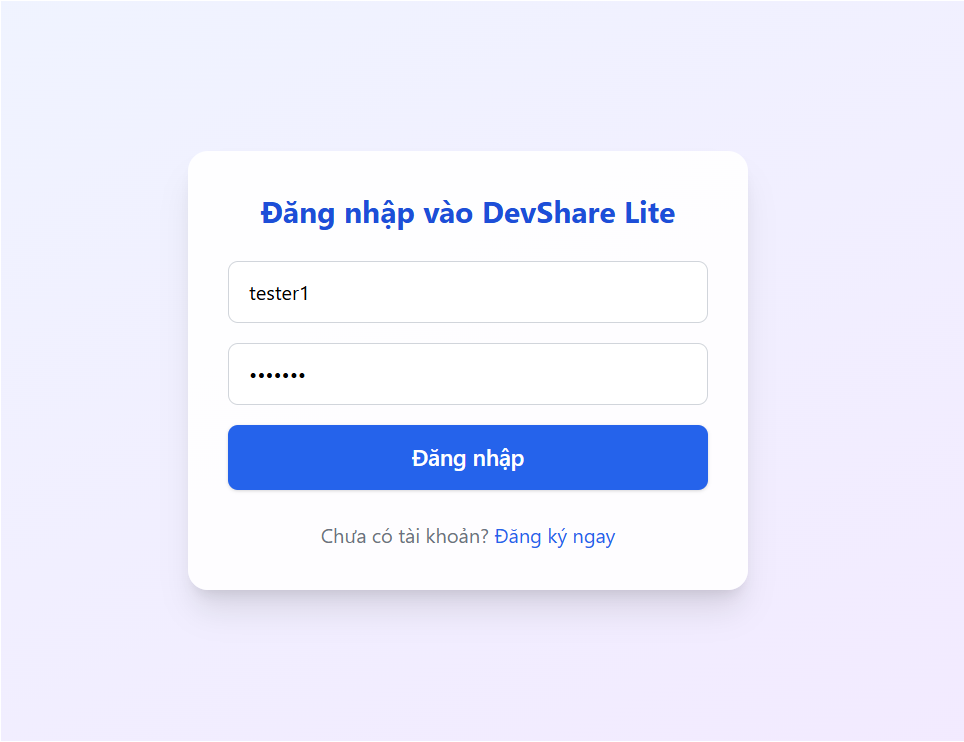
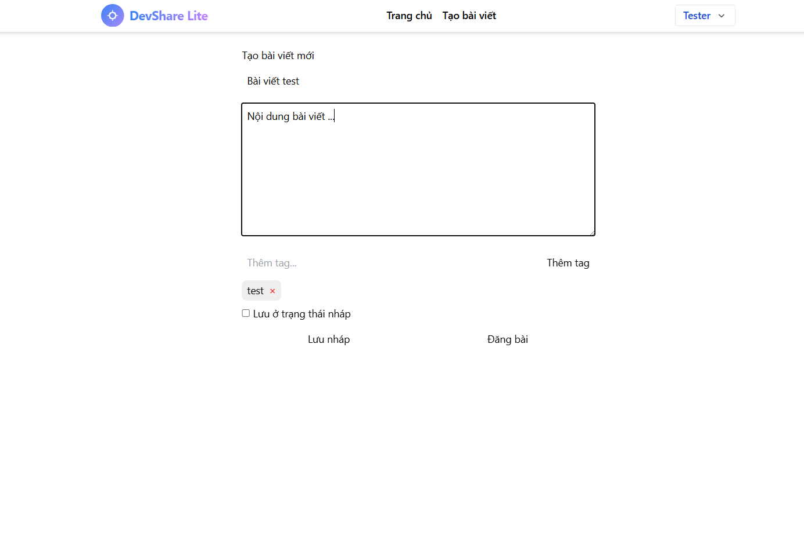
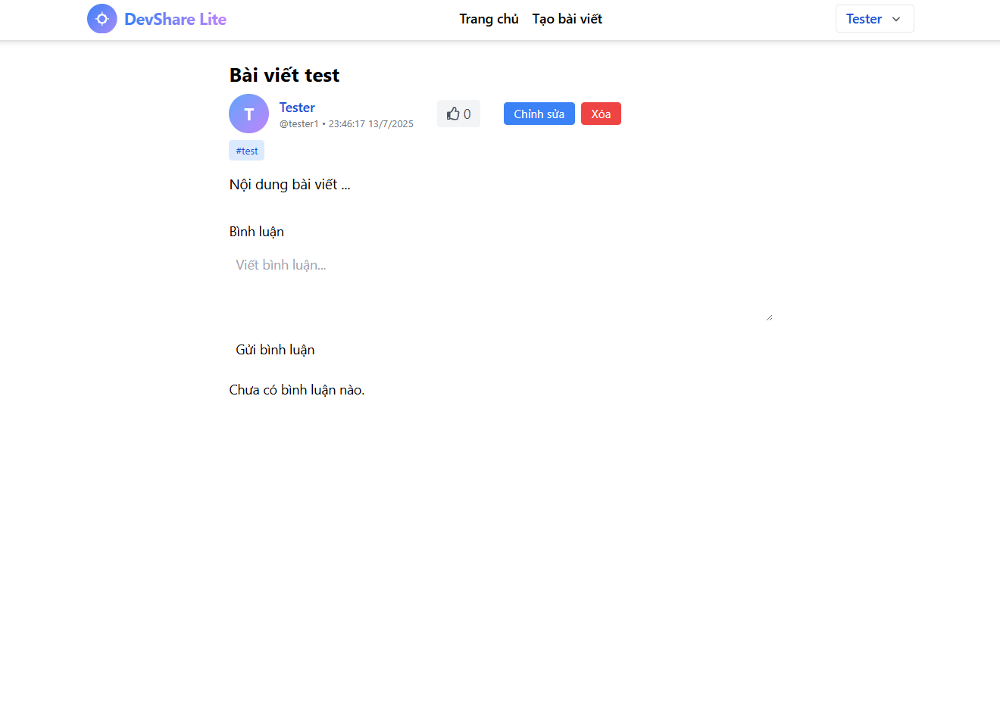
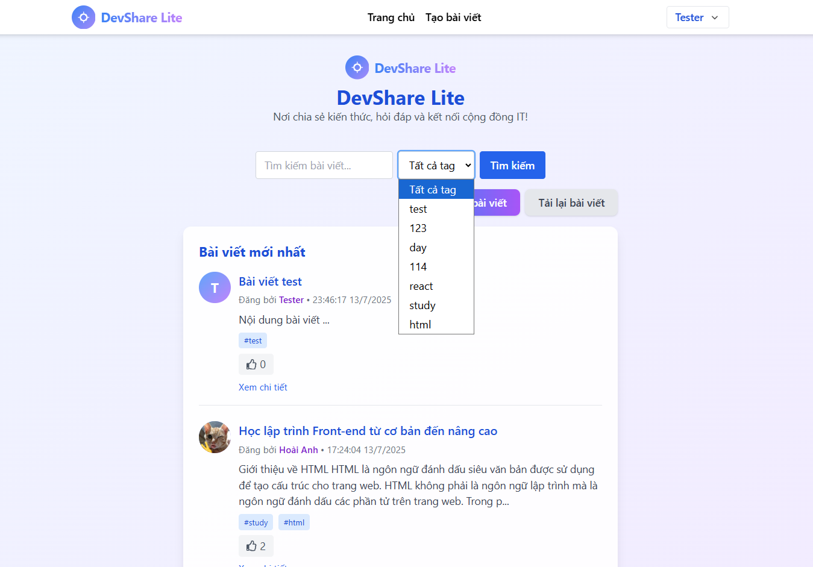
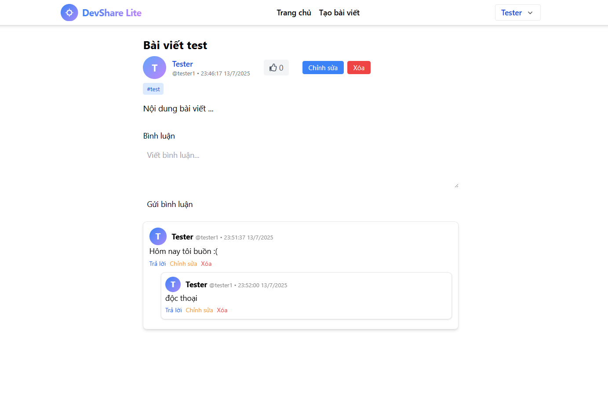
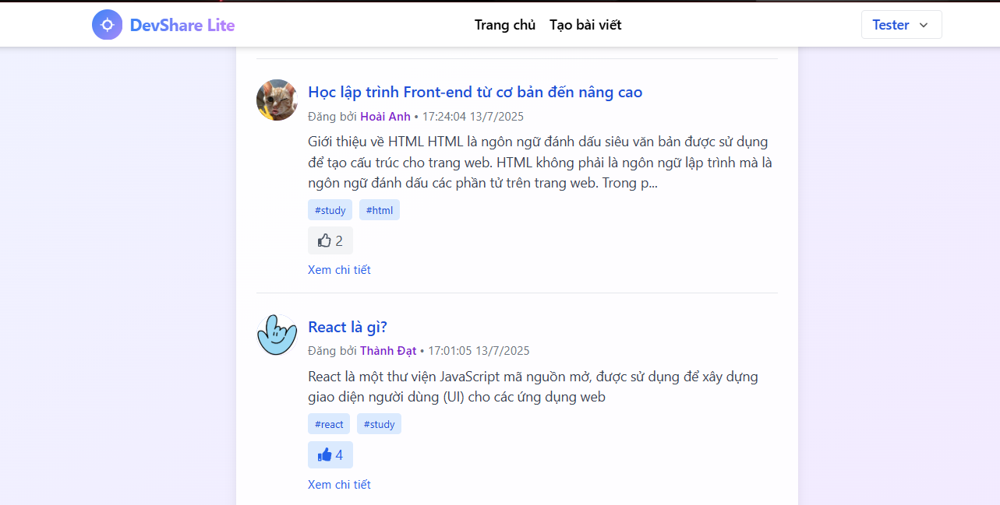
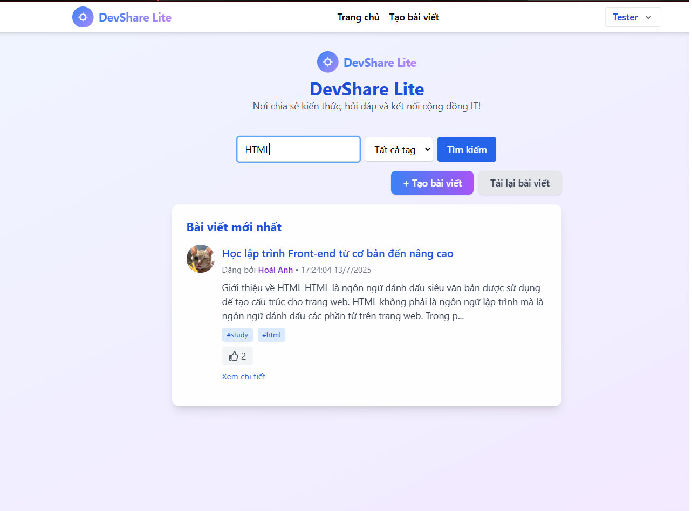
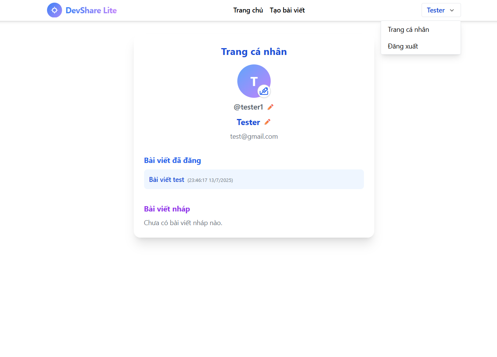
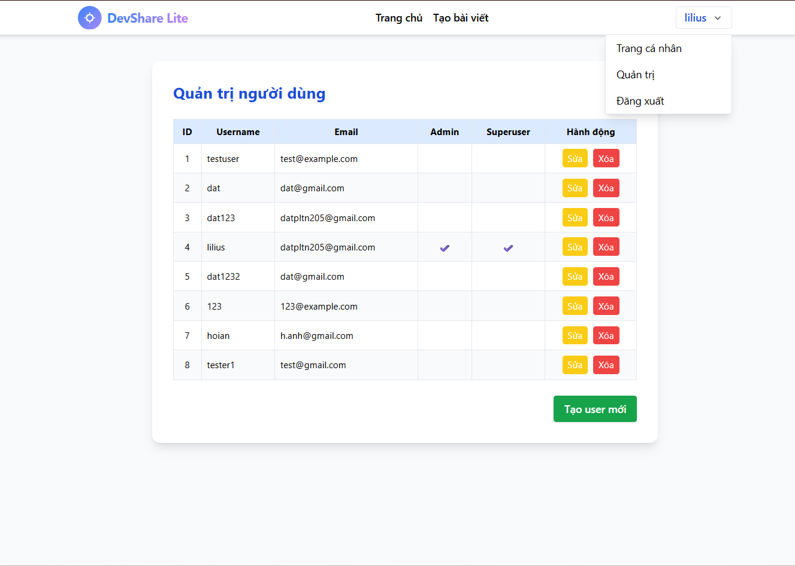

# TÍNH NĂNG DEVSHARE LITE

## 🚀 Tổng quan sản phẩm

DevShare Lite là một nền tảng chia sẻ kiến thức và hỏi đáp dành cho cộng đồng IT. Đây là phiên bản nhẹ với các chức năng cơ bản nhưng đầy đủ để phục vụ nhu cầu chia sẻ kiến thức và tương tác trong cộng đồng.

## 📋 Các chức năng chính

### 1. 🔐 Hệ thống xác thực

#### Đăng ký tài khoản
- **Tên đăng nhập**: Chỉ chứa chữ cái, số, dấu gạch dưới (3-30 ký tự)
- **Tên hiển thị**: Tùy chọn, hỗ trợ tiếng Việt và ký tự đặc biệt
- **Email**: Validation tự động
- **Mật khẩu**: Bảo mật với Django password hashers

#### Đăng nhập
- JWT token authentication
- Remember me functionality
- Auto-redirect sau đăng nhập

### 2. 📝 Quản lý bài viết

#### Tạo bài viết
- **Tiêu đề**: Tối đa 255 ký tự
- **Nội dung**: Hỗ trợ Markdown
- **Tags**: Tự động tạo hoặc chọn từ danh sách có sẵn
- **Draft mode**: Lưu nháp để chỉnh sửa sau
- **Preview**: Xem trước nội dung

#### Chỉnh sửa bài viết
- Chỉ tác giả hoặc admin mới có quyền chỉnh sửa
- Cập nhật real-time
- Lịch sử chỉnh sửa được lưu trữ

#### Xóa bài viết
- Confirm dialog trước khi xóa
- Chỉ tác giả hoặc admin mới có quyền xóa
- Xóa cascade các bình luận và like

### 3. 🏷️ Hệ thống tag

#### Quản lý tag
- **Tự động tạo**: Khi tạo bài viết với tag mới
- **Gợi ý**: Hiển thị tag có sẵn khi gõ
- **Phân loại**: Mỗi bài viết có thể có nhiều tag
- **Tìm kiếm**: Lọc bài viết theo tag

### 4. 💬 Hệ thống bình luận

#### Bình luận cơ bản
- **Nội dung**: Hỗ trợ text đa dòng
- **Tác giả**: Hiển thị avatar và tên
- **Thời gian**: Timestamp tự động
- **Chỉnh sửa**: Tác giả có thể sửa bình luận của mình

#### Reply bình luận
- **Nested comments**: Hỗ trợ reply lồng nhau
- **Thread view**: Hiển thị theo cấu trúc cây
- **Indentation**: Thụt lề để phân biệt cấp độ

#### Xóa bình luận
- Chỉ tác giả hoặc admin mới có quyền xóa
- Xóa cascade các reply con

### 5. 👍 Tương tác Like/Unlike

#### Like bài viết
- **One-click**: Like/unlike với một click
- **Counter**: Hiển thị số lượng like
- **Visual feedback**: Icon thay đổi khi đã like
- **Real-time**: Cập nhật ngay lập tức

### 6. 🔍 Tìm kiếm và lọc

#### Tìm kiếm
- **Full-text search**: Tìm trong tiêu đề và nội dung
- **Real-time**: Kết quả hiển thị ngay khi gõ
- **Highlight**: Làm nổi bật từ khóa tìm kiếm

#### Lọc theo tag
- **Dropdown**: Chọn tag từ danh sách
- **Multiple tags**: Kết hợp nhiều tag
- **Clear filter**: Xóa bộ lọc dễ dàng

### 7. 👤 Quản lý profile

#### Thông tin cá nhân
- **Display name**: Tên hiển thị có thể chỉnh sửa
- **Username**: Tên đăng nhập (chỉ admin có thể sửa)
- **Avatar**: Upload và crop ảnh đại diện
- **Email**: Thông tin liên hệ

#### Bài viết cá nhân
- **Published posts**: Danh sách bài viết đã đăng
- **Draft posts**: Bài viết nháp
- **Statistics**: Số lượng bài viết, like, comment

### 8. 👨‍💼 Admin panel

#### Quản lý user
- **User list**: Danh sách tất cả user
- **Role management**: Cấp quyền admin
- **User details**: Xem thông tin chi tiết user
- **Ban user**: Vô hiệu hóa tài khoản

## ⭐ Tính năng nâng cao đã thực hiện

### 1. 🎨 UI/UX hiện đại
- **Responsive design**: Hoạt động tốt trên mobile và desktop
- **Gradient backgrounds**: Giao diện đẹp mắt
- **Smooth animations**: Chuyển động mượt mà
- **Loading states**: UX tốt với loading indicators
- **Toast notifications**: Thông báo real-time

### 2. 🔄 Real-time updates
- **Auto-refresh**: Tự động cập nhật dữ liệu
- **Live counters**: Số like, comment cập nhật real-time
- **Instant feedback**: Phản hồi ngay lập tức cho user actions

### 3. 📱 Mobile-first design
- **Touch-friendly**: Buttons và controls phù hợp với mobile
- **Responsive layout**: Tự động điều chỉnh theo màn hình
- **Mobile navigation**: Menu và navigation tối ưu cho mobile

### 4. 🔒 Bảo mật nâng cao
- **JWT tokens**: Xác thực stateless
- **Role-based access**: Phân quyền chi tiết
- **Input validation**: Kiểm tra dữ liệu đầu vào
- **XSS protection**: Ngăn chặn cross-site scripting

### 5. 🎯 SEO optimization
- **Meta tags**: Tối ưu cho search engines
- **Semantic HTML**: Cấu trúc HTML có ý nghĩa
- **Fast loading**: Tối ưu tốc độ tải trang

## 🐛 Vấn đề gặp phải và giải pháp

### 1. **Vấn đề**: JWT token expiration
**Mô tả**: Token hết hạn khiến user bị logout đột ngột
**Giải pháp**: 
- Thêm refresh token mechanism
- Auto-redirect to login khi token expired
- Clear localStorage và reset state

### 2. **Vấn đề**: Image upload security
**Mô tả**: Nguy cơ upload file độc hại
**Giải pháp**:
- Validate file type (chỉ cho phép image)
- Limit file size (max 5MB)
- Sanitize filename
- Store trong thư mục riêng biệt

### 3. **Vấn đề**: Concurrent access SQLite
**Mô tả**: Lỗi khi nhiều user cùng ghi database
**Giải pháp**:
- Sử dụng Django transaction management
- Implement retry mechanism
- Consider migration to PostgreSQL for production

### 4. **Vấn đề**: XSS trong comments
**Mô tả**: User có thể inject JavaScript
**Giải pháp**:
- Sanitize HTML input
- Use Django's built-in XSS protection
- Implement content security policy

### 5. **Vấn đề**: Performance với large datasets
**Mô tả**: Chậm khi có nhiều bài viết/bình luận
**Giải pháp**:
- Implement pagination
- Add database indexes
- Optimize queries với select_related/prefetch_related

## ⚠️ Giới hạn đã biết

### 1. **Database limitations**
- **SQLite**: Không phù hợp cho production với traffic cao
- **Concurrent writes**: Hạn chế khi nhiều user cùng ghi
- **File size**: Database file có thể lớn theo thời gian

### 2. **Performance limitations**
- **No caching**: Chưa có Redis cache
- **No CDN**: Images được serve trực tiếp từ server
- **No search engine**: Tìm kiếm cơ bản, chưa có Elasticsearch

### 3. **Feature limitations**
- **No real-time chat**: Chỉ có comments, không có chat
- **No notifications**: Chưa có hệ thống thông báo
- **No file upload**: Chỉ có avatar, chưa hỗ trợ upload file khác
- **No email verification**: Chưa xác thực email

### 4. **Security limitations**
- **No rate limiting**: Chưa giới hạn số request
- **No 2FA**: Chưa có two-factor authentication
- **No audit log**: Chưa log các hoạt động quan trọng

### 5. **Scalability limitations**
- **Single server**: Chưa hỗ trợ horizontal scaling
- **No load balancing**: Chưa có load balancer
- **No microservices**: Monolithic architecture

## 🚀 Định hướng tương lai

### 1. **Short-term (1-3 tháng)**

#### Performance improvements
- [ ] **Redis caching**: Cache frequently accessed data
- [ ] **CDN integration**: Serve static files via CDN
- [ ] **Database optimization**: Add more indexes
- [ ] **Image optimization**: Compress and resize images

#### Feature enhancements
- [ ] **Email notifications**: Notify users about new comments/likes
- [ ] **File upload**: Support for document/image uploads
- [ ] **Rich text editor**: WYSIWYG editor for posts
- [ ] **Bookmark posts**: Save favorite posts

#### Security improvements
- [ ] **Rate limiting**: Prevent spam and abuse
- [ ] **Email verification**: Verify user email addresses
- [ ] **Password strength**: Enforce strong passwords
- [ ] **Audit logging**: Log important user actions

### 2. **Medium-term (3-6 tháng)**

#### Advanced features
- [ ] **Real-time notifications**: WebSocket for live updates
- [ ] **Advanced search**: Elasticsearch integration
- [ ] **User badges**: Achievement system
- [ ] **Post categories**: Better content organization
- [ ] **Moderation tools**: Report and flag inappropriate content

#### Infrastructure
- [ ] **PostgreSQL migration**: Switch to production database
- [ ] **Docker deployment**: Containerized application
- [ ] **CI/CD pipeline**: Automated testing and deployment
- [ ] **Monitoring**: Application performance monitoring

### 3. **Long-term (6-12 tháng)**

#### Platform expansion
- [ ] **Mobile app**: Native iOS/Android apps
- [ ] **API documentation**: Public API for third-party integrations
- [ ] **Plugin system**: Extensible architecture
- [ ] **Multi-language**: Internationalization support

#### Advanced analytics
- [ ] **User analytics**: Track user behavior
- [ ] **Content analytics**: Popular posts, trending topics
- [ ] **SEO analytics**: Search engine performance
- [ ] **A/B testing**: Test different features

#### Enterprise features
- [ ] **Team collaboration**: Private workspaces
- [ ] **SSO integration**: Single sign-on with enterprise systems
- [ ] **Advanced permissions**: Granular access control
- [ ] **Backup and recovery**: Automated data backup

### 4. **Technical roadmap**

#### Architecture improvements
- [ ] **Microservices**: Break down into smaller services
- [ ] **Event-driven architecture**: Message queues for async processing
- [ ] **GraphQL API**: More flexible API design
- [ ] **Service mesh**: Inter-service communication

#### DevOps and infrastructure
- [ ] **Kubernetes**: Container orchestration
- [ ] **Auto-scaling**: Automatic resource scaling
- [ ] **Multi-region**: Global deployment
- [ ] **Disaster recovery**: Backup and failover systems

## 📊 Metrics và KPIs

### User engagement
- **Daily active users**: Số user hoạt động hàng ngày
- **Posts per day**: Số bài viết mới mỗi ngày
- **Comments per post**: Trung bình comment mỗi bài viết
- **Like rate**: Tỷ lệ like trên tổng số view

### Performance metrics
- **Page load time**: Thời gian tải trang
- **API response time**: Thời gian phản hồi API
- **Database query time**: Thời gian truy vấn database
- **Error rate**: Tỷ lệ lỗi

### Content quality
- **Post completion rate**: Tỷ lệ hoàn thành bài viết
- **Comment quality**: Đánh giá chất lượng bình luận
- **User retention**: Tỷ lệ user quay lại
- **Content moderation**: Số lượng content bị report

